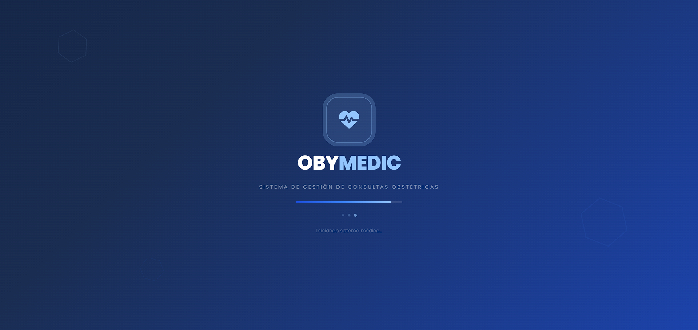
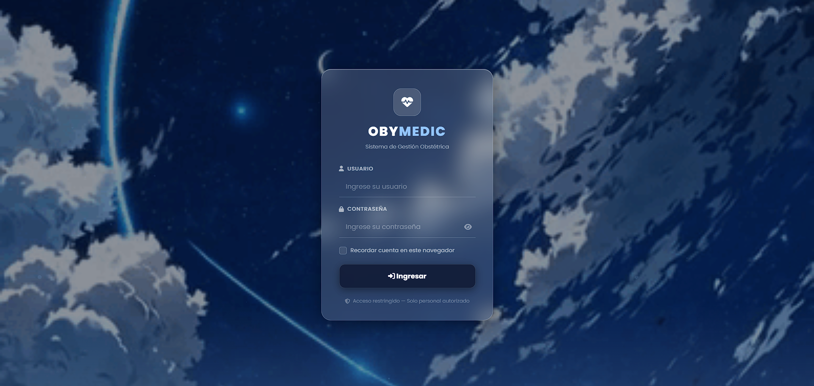
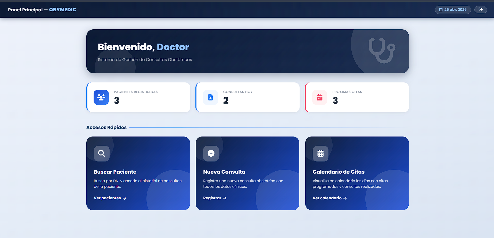
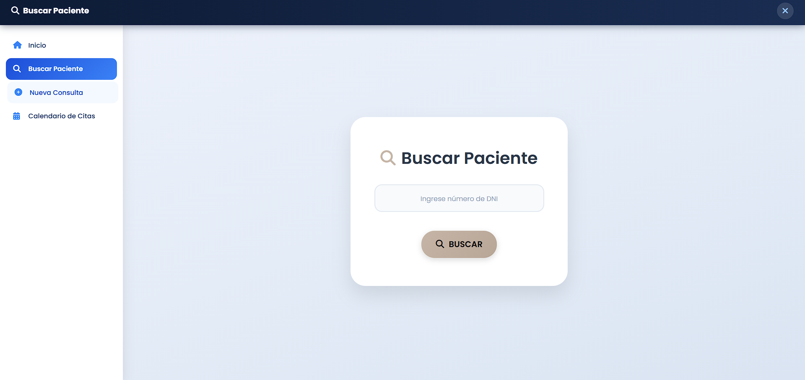
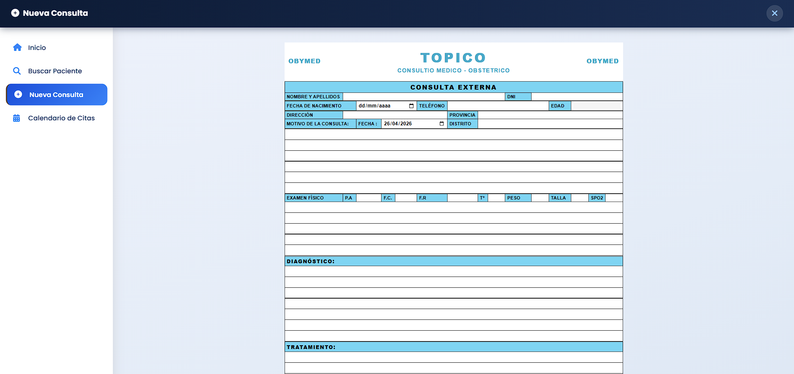
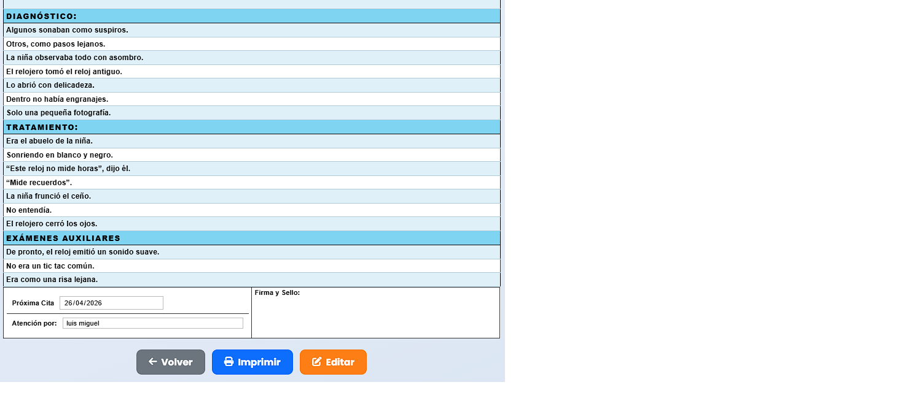
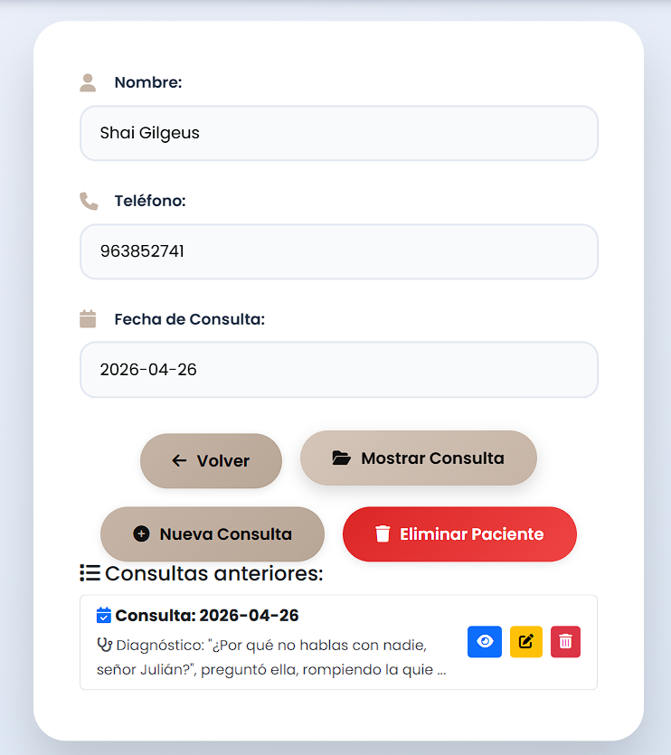
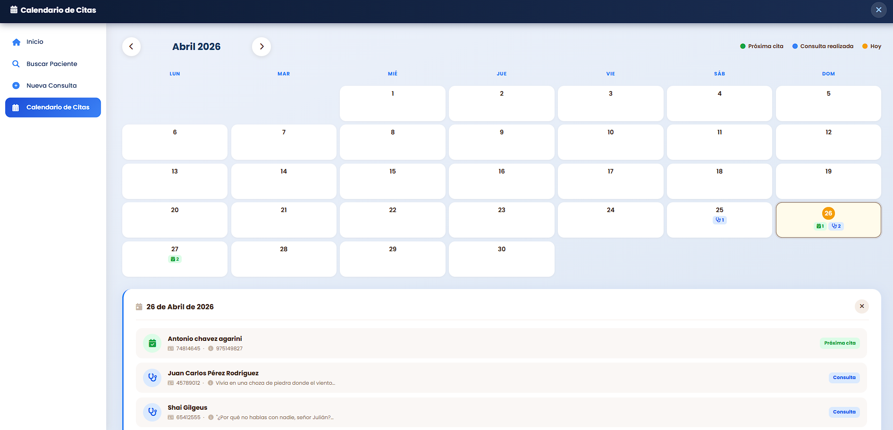

# OBYMEDIC — Lógica y Uso de la Aplicación

## ¿Qué es OBYMEDIC?

Sistema web de gestión de consultas obstétricas. Permite registrar pacientes, guardar consultas médicas, ver el historial, subir exámenes de laboratorio, programar citas y administrar todo desde cualquier navegador.

---

## Flujo principal de uso

### 1. Pantalla de carga
Al abrir el link, aparece una pantalla de carga animada mientras la app se inicializa.

---

### 2. Login
Se ingresan las credenciales. Existe un rol principal:

- **Doctor** — accede al panel médico completo

**Lo que NO se debe hacer:**
- No compartir las credenciales con personas externas
- No usar el botón atrás del navegador para volver al login; usar siempre el botón de cerrar sesión

---

### 3. Panel Principal
Muestra tres contadores en tiempo real:
- Pacientes registradas
- Consultas realizadas hoy
- Próximas citas

Y tres accesos rápidos: **Buscar Paciente**, **Registrar Paciente**, **Calendario de Citas**.

---

### 4. Buscar Paciente
Se ingresa el DNI del paciente. Si existe un registro previo, carga su información automáticamente y muestra el historial de consultas anteriores.

**Lo que NO se debe hacer:**
- No buscar con DNI incompleto (debe ser exactamente 8 dígitos)

---

### 5. Registrar Paciente
Formulario completo para registrar una consulta. Si el DNI ya existe en el sistema, los datos del paciente se cargan automáticamente con un aviso en amarillo. Si el DNI no existe, se consulta la API de RENIEC para autocompletar el nombre.

Campos del formulario:
- Datos del paciente (nombre, DNI, teléfono, dirección, etc.)
- Datos clínicos (PA, FC, FR, temperatura, peso, talla, SpO2)
- Motivo, diagnóstico, tratamiento, exámenes auxiliares
- Próxima cita (opcional)
- Atención por (selector de doctor) — vincula automáticamente la imagen de firma

**Lo que NO se debe hacer:**
- No registrar un DNI con menos o más de 8 dígitos
- No ingresar un teléfono que no empiece en 9
- No poner una fecha de consulta anterior a hoy
- Si se pone próxima cita, debe ser a partir de mañana

Al guardar, redirige automáticamente a la **ficha de consulta**.

---

### 6. Ficha de Consulta
Muestra todos los datos de una consulta. Desde aquí se puede:
- **Editar** los datos de la consulta
- **Imprimir** la ficha (el topbar y sidebar se ocultan automáticamente al imprimir)
- La firma y sello se muestra automáticamente según el doctor seleccionado al registrar

---

### 7. Historial Médico
Lista todas las consultas anteriores de un paciente en tarjetas con fecha (día y mes), tipo y diagnóstico. Permite:
- Ver cada consulta individualmente
- Editar una consulta
- Eliminar una consulta
- Registrar una nueva consulta para el mismo paciente
- Subir, ver y eliminar **Exámenes de Laboratorio** (PDF) desde el botón azul

#### Exámenes de Laboratorio
Al presionar el botón **Exámenes de Laboratorio** se abre un modal con dos pestañas:
- **Subir Examen** — ingresa un título, selecciona un archivo PDF (máx. 15 MB) y lo sube
- **Ver Exámenes** — lista todos los PDFs subidos del paciente; cada uno puede verse en el navegador o eliminarse

---

### 8. Calendario de Citas
Vista de calendario con los días que tienen citas programadas marcados visualmente.

---

### 9. Selector de Doctor y Firma

Al registrar o editar una consulta, el campo **Atención por** es un selector desplegable con los doctores disponibles. Al seleccionar un doctor, la imagen de firma que aparece en la ficha se actualiza automáticamente.

Los doctores y sus imágenes de firma están vinculados por ID numérico:
- Doctor 1 → `assets/img/doctor1.png`
- Doctor 2 → `assets/img/doctor2.png`
- Doctor 3 → `assets/img/doctor3.png`
- Doctor 4 → `assets/img/doctor4.png`

Para cambiar la imagen de un doctor: reemplazar el archivo `doctorN.png` con la nueva imagen (mismo nombre), hacer push al repositorio y esperar el deploy automático.

---

## Reglas generales

| Acción | Permitida |
|--------|-----------|
| Registrar paciente nuevo | ✅ |
| Registrar segunda consulta al mismo paciente | ✅ |
| Dejar "próxima cita" vacía | ✅ |
| Editar una consulta ya guardada | ✅ |
| Eliminar una consulta | ✅ |
| Subir examen de laboratorio PDF | ✅ |
| Ver y descargar examen PDF desde el historial | ✅ |
| Registrar DNI de menos de 8 dígitos | ❌ |
| Poner fecha de consulta anterior a hoy | ❌ |
| Poner próxima cita en el mismo día o antes | ❌ |
| Subir archivo que no sea PDF | ❌ |
