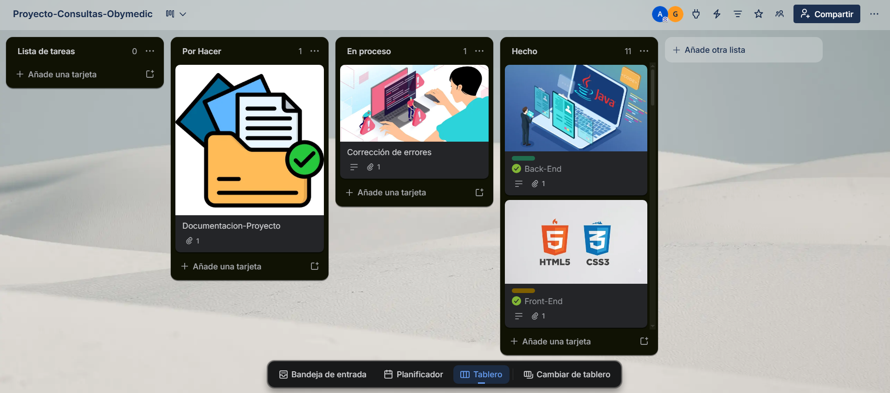
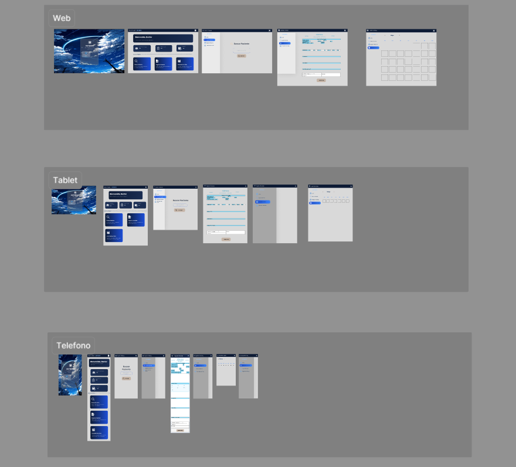
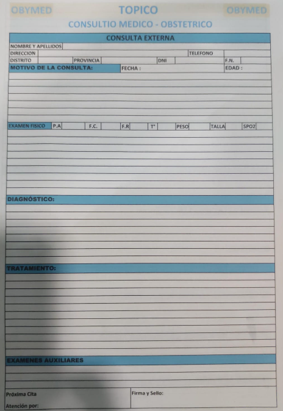
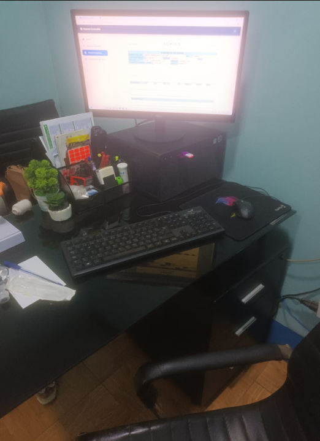
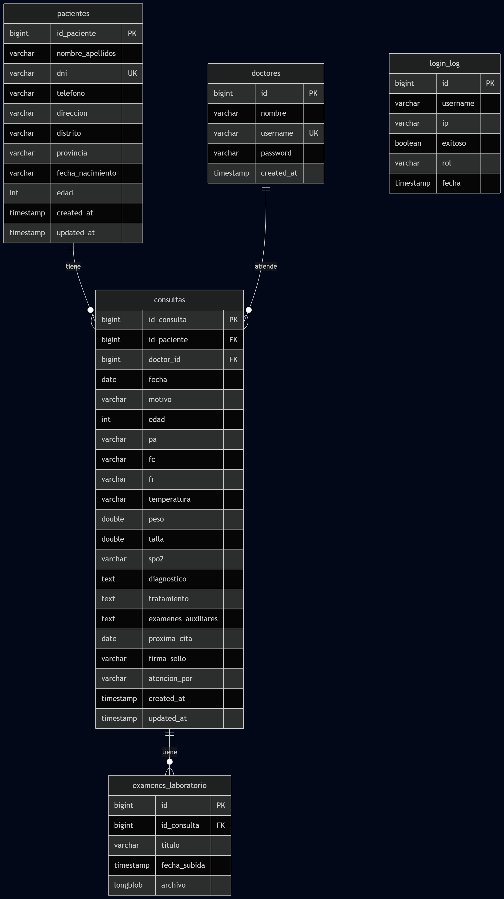
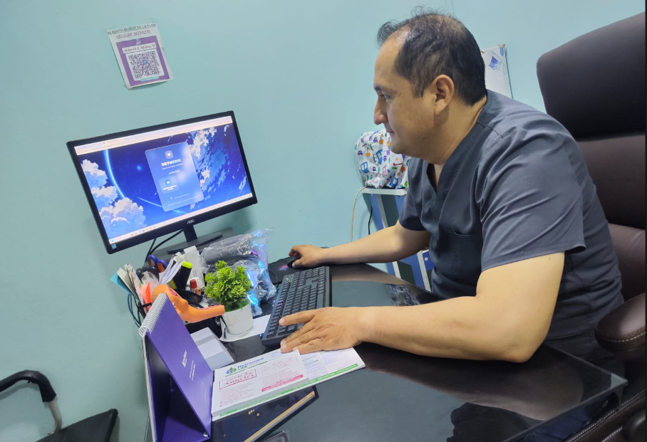
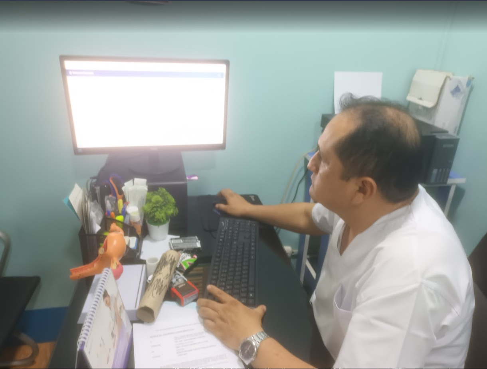

# SISTEMA DE GESTION DE HISTORIAS CLINICAS - OBYMEDIC

[](https://trello.com/invite/b/69bc3ede73d188581baa1482/ATTI3f827d0ff18d1e9bfddfe0ef1a6bd47a27F9FC1E/proyecto-consultas-obymedic)
[](https://www.figma.com/design/dFzpMUTmaB7KElQrPPwFOD/Sin-t%C3%ADtulo?node-id=0-1&t=KiShFYyaKIPP5eD5-1)
[](https://obymedic.onrender.com)

## TRELLO
Más info en [mi tablero de trello](https://trello.com/invite/b/69bc3ede73d188581baa1482/ATTI3f827d0ff18d1e9bfddfe0ef1a6bd47a27F9FC1E/proyecto-consultas-obymedic)


### DIAGRAMA DE FIGMA
Más info en [Mi_Diseño_Figma](https://www.figma.com/design/dFzpMUTmaB7KElQrPPwFOD/Sin-t%C3%ADtulo?node-id=0-1&t=KiShFYyaKIPP5eD5-1)




Sistema web para la gestión de registros de historiales medicos de Obstetricia

## Descripcion del negocio
Nombre: Alber Einstein Muños de la flor <br>
Consultorio Médico: Obymedic <br>
RUC: 10431624163 <br>
El consultorio brinda atención médica general y especialmente de Obstetricia <br>

## Identificar el problema y solución
Problema: Actualmente el médico registra los historiales médicos de manera manual (en físico), lo que genera. <br>
•	Pérdida de tiempo al buscar información<br>
•	Riesgo de extravío de documentos<br>
•	Desorganización en los registros<br>
•	Dificultad para encontrar historiales por paciente<br>
•	Acumulación de archivos físicos<br>

Solucion tecnologica: Se desarrollará un Sistema Digital de Gestión de Historiales Médicos, el cual permitirá:
•	Registrar pacientes con su DNI. <br>
•	Guardar múltiples historiales asociados a un mismo DNI. <br>
•	Implementar un filtro de búsqueda por DNI. <br>
•	Mostrar automáticamente los datos del paciente y fechas de atención. <br>
•	Almacenar la información en una base de datos digital. <br>

##  Imágenes del problema


---
##  Imágenes del negocio


## Requerimientos Funcionales
| Requerimiento | Descripcion |
|---|---|
| Registrar paciente | El sistema debe permitir registrar pacientes utilizando su DNI.|
| Guardar datos del paciente | El sistema debe almacenar nombre completo, edad, teléfono y dirección del paciente. |
| Registrar historial médico | El sistema debe permitir registrar un historial médico asociado al DNI del paciente. |
| Guardar información médica | El historial debe incluir fecha de atención, diagnóstico, tratamiento y observaciones. |
| Búsqueda de paciente | El sistema debe permitir buscar pacientes mediante su DNI. |
| Mostrar resultados | El sistema debe mostrar el nombre del paciente y las fechas de sus historiales médicos. |
| Ver detalle del historial | El sistema debe mostrar el nombre del paciente y las fechas de sus historiales médicos. |
| Editar historial médico | El sistema debe permitir modificar o actualizar la información del historial médico. |

## Requerimientos No Funcionales
| Requerimiento | Descripcion |
|---|---|
| Facilidad de uso | El sistema debe tener una interfaz sencilla y fácil de usar. |
| Seguridad | El acceso al sistema debe realizarse mediante usuario y contraseña. |
| Almacenamiento seguro | La información debe almacenarse en una base de datos segura. |
| Rendimiento | El sistema debe responder a las búsquedas en menos de 3 segundos. |

## Stack completo
1. Trello             = Gestión del proyecto (Kanban)
2. Draw.io            = Diagrama ER + Diagrama de Clases
3. Figma              = Wireframe + Diseño UI/UX
4. MySQL Workbench    = Diseñar y administrar BD local
5. IntelliJ           = Frontend (HTML,CSS,JS) + Backend (Spring Boot)
6. XAMPP              = MySQL para desarrollo local
7. Docker             = Contenedor para despliegue en producción
8. Render             = Hosting del Web Service (nube)
9. Neon               = Base de datos PostgreSQL en producción (nube)
10. UptimeRobot       = Monitoreo para mantener la app activa

## Tecnologias utilizadas
- Java 21
- Spring Boot 3
- MySQL 8 (desarrollo local)
- PostgreSQL 17 — Neon (producción)
- HTML5, CSS3, JavaScript
- IntelliJ IDEA
- XAMPP
- MySQL Workbench
- Docker
- Figma (diseño UI/UX)
- Draw.io (diagramas)

## APIs externas
| API | Uso |
|---|---|
| apiperu.dev | Consulta DNI en RENIEC para autocompletar datos del paciente |
| Gmail SMTP | Envío de backup semanal automático al correo |

## Estructura del proyecto

```
Obymedic_/
├── Backend/                        → Spring Boot (Java) + Frontend embebido
│   ├── src/
│   │   └── main/
│   │       ├── java/               → Código Java (controllers, entities, services)
│   │       └── resources/
│   │           ├── static/         → Frontend (HTML, CSS, JS) servido por Spring Boot
│   │           └── application.properties
│   ├── target/
│   │   └── obymedic-0.0.1-SNAPSHOT.jar
│   ├── secrets.properties          → Tokens y claves (no subir a GitHub)
│   ├── Dockerfile
│   └── pom.xml
└── Frontend/                       → Copia local de desarrollo (no se despliega)
```

## Base de datos

El sistema cuenta con 5 tablas principales:

| Tabla | Descripcion |
|---|---|
| paciente | Datos del paciente: DNI, nombre, teléfono, dirección, fecha de nacimiento |
| consulta | Historial clínico: signos vitales, diagnóstico, tratamiento, firma |
| doctor | Cuentas de acceso de los médicos |
| examen_laboratorio | Archivos PDF de exámenes adjuntos a una consulta |
| login_log | Registro de accesos al sistema |


### Base de datos (desarrollo local — MySQL)

```sql
CREATE DATABASE obymedic;
USE obymedic;

CREATE TABLE pacientes (
    id_paciente  AUTO_INCREMENT PRIMARY KEY,
    nombre_apellidos VARCHAR(150) NOT NULL,
    dni VARCHAR(8) NOT NULL UNIQUE,
    telefono VARCHAR(20),
    direccion VARCHAR(150),
    distrito VARCHAR(100),
    provincia VARCHAR(100),
    fecha_nacimiento VARCHAR(20),
    edad INT,
    created_at TIMESTAMP DEFAULT CURRENT_TIMESTAMP,
    updated_at TIMESTAMP DEFAULT CURRENT_TIMESTAMP ON UPDATE CURRENT_TIMESTAMP
);

CREATE TABLE consultas (
    id_consulta  AUTO_INCREMENT PRIMARY KEY,
    id_paciente  NOT NULL,
    fecha DATE,
    motivo VARCHAR(255),
    edad INT,
    pa VARCHAR(20),
    fc VARCHAR(20),
    fr VARCHAR(20),
    temperatura VARCHAR(20),
    peso DOUBLE,
    talla DOUBLE,
    spo2 VARCHAR(10),
    diagnostico TEXT,
    tratamiento TEXT,
    examenes_auxiliares TEXT,
    proxima_cita DATE,
    firma_sello VARCHAR(150),
    atencion_por VARCHAR(150),
    created_at TIMESTAMP DEFAULT CURRENT_TIMESTAMP,
    updated_at TIMESTAMP DEFAULT CURRENT_TIMESTAMP ON UPDATE CURRENT_TIMESTAMP,
    CONSTRAINT fk_paciente
    FOREIGN KEY (id_paciente)
    REFERENCES pacientes(id_paciente)
    ON DELETE CASCADE
);

CREATE TABLE doctores (
    id  AUTO_INCREMENT PRIMARY KEY,
    nombre VARCHAR(150) NOT NULL,
    username VARCHAR(100) NOT NULL UNIQUE,
    password VARCHAR(255) NOT NULL,
    created_at TIMESTAMP DEFAULT CURRENT_TIMESTAMP
);

CREATE TABLE examenes_laboratorio (
    id  T AUTO_INCREMENT PRIMARY KEY,
    id_consulta  NOT NULL,
    nombre_archivo VARCHAR(255),
    tipo_archivo VARCHAR(100),
    datos LONGBLOB,
    created_at TIMESTAMP DEFAULT CURRENT_TIMESTAMP,
    CONSTRAINT fk_consulta_examen
    FOREIGN KEY (id_consulta)
    REFERENCES consultas(id_consulta)
    ON DELETE CASCADE
);

CREATE TABLE login_log (
    id AUTO_INCREMENT PRIMARY KEY,
    username VARCHAR(100),
    ip VARCHAR(100),
    rol VARCHAR(50),
    fecha TIMESTAMP DEFAULT CURRENT_TIMESTAMP
);
```
##  Modelo Entidad Relacion


## Como correr el proyecto

### Requisitos previos
- JDK 21 o superior
- XAMPP (para MySQL local)
- IntelliJ IDEA

### Correr en local
1. Abrir la carpeta `Backend/` en IntelliJ IDEA
2. Iniciar XAMPP y activar MySQL
3. Crear la base de datos `obymedic` en phpMyAdmin
4. Verificar `application.properties` con los datos de MySQL
5. Ejecutar `ObymedicApplication.java`
6. Abrir en el navegador: `http://localhost:8080`


### Configuracion de base de datos (local)

```properties
spring.datasource.url=jdbc:mysql://localhost:3306/obymedic?useSSL=false&serverTimezone=UTC
spring.datasource.username=root
spring.datasource.password=
spring.datasource.driver-class-name=com.mysql.cj.jdbc.Driver
spring.jpa.hibernate.ddl-auto=update
spring.jpa.show-sql=true
spring.jpa.database-platform=org.hibernate.dialect.MySQLDialect
server.port=8080
```

## Despliegue en produccion

La app está desplegada en **Render** usando Docker. La base de datos en producción es **PostgreSQL en Neon**.

| Componente | Servicio | URL |
|---|---|---|
| Web Service | Render (Docker) | https://obymedic.onrender.com |
| Base de datos | Neon (PostgreSQL 17) | ep-steep-mud-apqfao2f.c-7.us-east-1.aws.neon.tech |
| Monitoreo | UptimeRobot | Mantiene la app activa |

##  Imágenes del Programa En Negocio

##  Imágenes del Programa En Negocio



